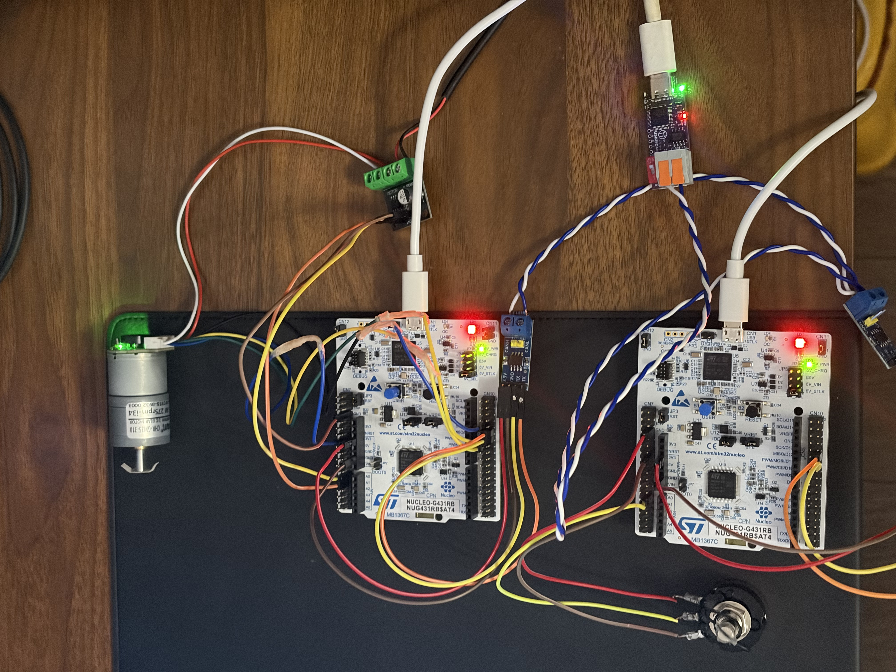
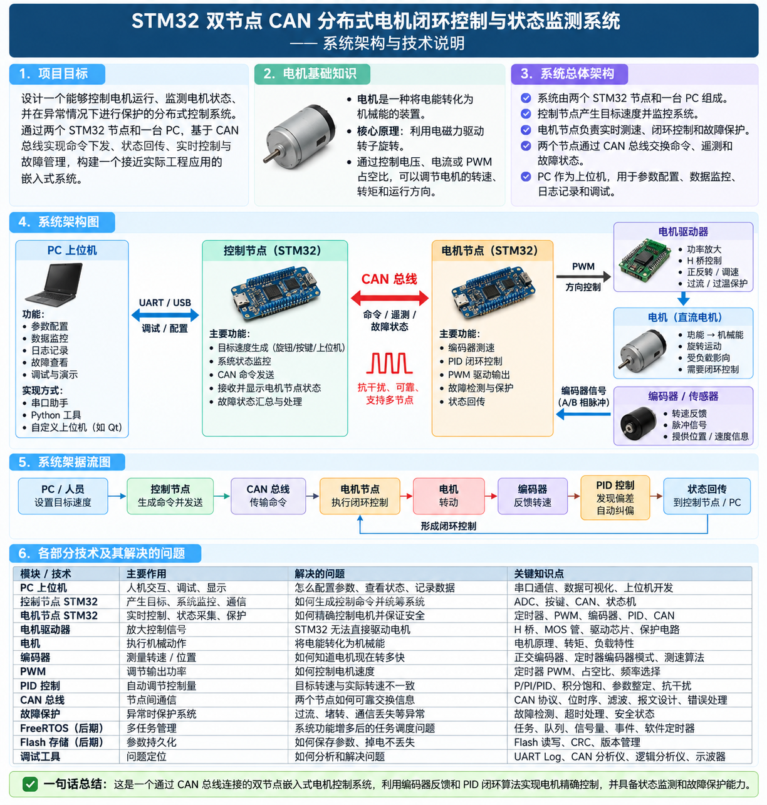

# STM32 双节点 CAN 分布式电机闭环控制与状态监测系统

基于双 STM32G431 节点、CAN 总线、增量式编码器和 FreeRTOS 实现的分布式直流电机闭环控制系统。

项目从 PWM 电机驱动开始，逐步加入编码器测速、PI 闭环控制、CAN 双节点通信、PC 远程控制、FreeRTOS 软件架构、Fault 状态机、Watchdog 和 Flash 参数持久化，最终形成一个完整的 MCU 控制系统 V1。



## Quick Links

- [项目演示](#1-项目演示)
- [系统架构](#2-系统架构)
- [CAN 协议](docs/can_protocol.md)
- [FreeRTOS 设计](docs/freertos_design.md)
- [Fault 设计](docs/fault_design.md)
- [Watchdog](docs/Watchdog.md)
- [Flash 参数保存](docs/Flash_persistence.md)
- [开发演进路线](docs/development_roadmap.md)
- [调试记录](docs/Debugging_Notes.md)

---

## 1. 项目演示

### 硬件功能演示

> TODO：补充视频链接

展示内容：

- LOCAL 电位器控制
- REMOTE PC 控制
- CAN 状态反馈
- CAN 失联保护
- 堵转保护
- 编码器异常保护
- Fault Reset
- 在线 PI 参数修改
- Flash 参数保存
- Watchdog 复位

### 软件架构讲解

> TODO：补充视频链接

主要讲解：

- FreeRTOS Task 划分
- CAN 中断接收流程
- Queue 解耦
- PI 实时控制回路
- Fault 状态机
- Watchdog 任务健康检测
- Flash 参数持久化

---

## 2. 系统架构

整体系统由两个 STM32G431 节点和 PC 上位机组成。



### 节点职责

**Controller Node**
- 采集电位器 ADC
- 生成 `local_target_rpm`
- 通过 CAN 发送本地目标转速

**Motor Node**
- 接收 CAN 控制命令
- 编码器测速
- PI 闭环控制
- PWM 输出
- Fault 检测与状态管理
- Watchdog
- Flash 参数持久化
- 向 PC 上报运行状态与故障状态

### 数据流

```c
PC / PCAN-View
      │
      │ CAN
      ↓
Controller Node ───────────────→ Motor Node
STM32G431RB                      STM32G431RB
      │                               │
Potentiometer                        FreeRTOS
      │                               │
ADC → local_target_rpm                │
                                      ↓
                                 PI Controller
                                      │
                                     PWM
                                      ↓
                                   DRV8871
                                      ↓
                                  DC Motor
                                      ↓
                                  AB Encoder
                                      │
                                      └──→ RPM Feedback
```

